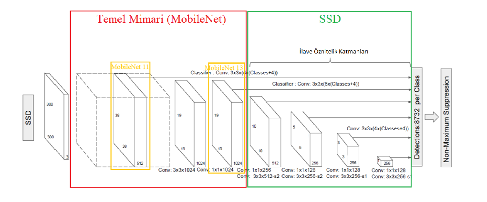
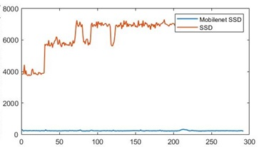
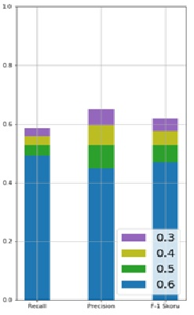
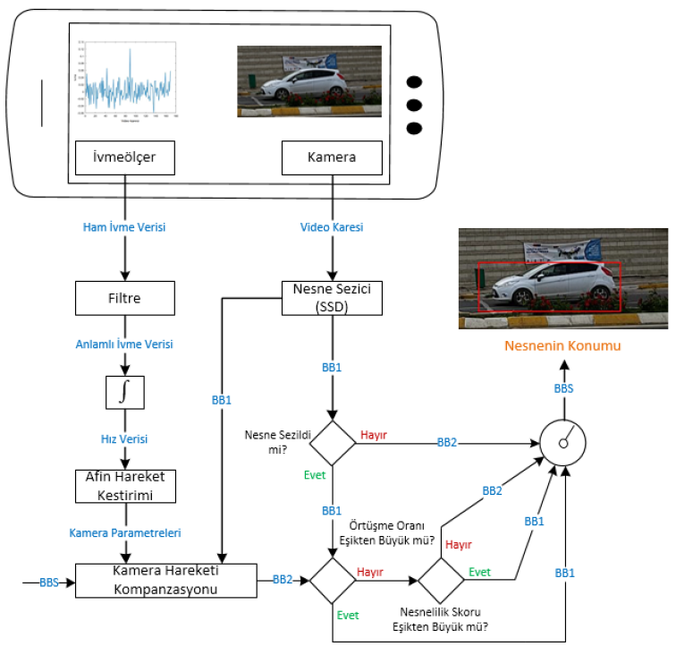

# Android Video Object Detection

This repository provides an example for mobile video object detection and how to increase its accuracy using accelerometer data. Provided way to improve accuracy is a part of my master’s thesis.

## About MobileNet SSD

Briefly, [MobileNet](https://arxiv.org/abs/1704.04861) is a backbone (the part of neural network which is used for feature extraction) for Convolutional Neural Networks (CNNs) and it uses depthwise separable convolution instead of classical convolution. Thanks to its specific convolution type, it is faster than similar backbones.

[Single Shot Detector (SSD)](https://arxiv.org/abs/1512.02325) is a Convolutional Neural Network (CNN) which is developed for object detection and it uses [VGG-16](https://arxiv.org/abs/1409.1556) as backbone by default.

MobileNet SSD is a combination of classical SSD and MobileNet. It uses MobileNet as backbone instead of VGG-16. This change in backbone makes MobileNet SSD faster than a classical SSD (and unfortunately less accurate). It requires less computing power and memory and consumes less power, so it is more mobile friendly. The following drawing shows how MobileNet and SSD architectures are combined.

Following plot compares detection speed of both SSD and MobileNet SSD for an example video in an Android device (Xiaomi Mi 5s). Horizontal axis represents frames and vertical axis shows the time spent for each frame in miliseconds. As you can see clearly, the difference in speed is dramatic.

Additionaly, following plot shows the performance of MobileNet SSD on [MS COCO](https://cocodataset.org/#home) 2014 test dataset with respect to different Intersection over Union (IoU) thresholds. Bars represet recall, precision and F-1 score, respectively.

Following videos demonstrate the object detection results of MobileNet SSD. Videos are processed in real-time on an Android device.

## Increasing Accuracy by Using Accelerometer

In mobile videography, camera moves most of the time. Also, almost every mobile device has an accelerometer that can measure the device (and also camera) movement. Therefore, acceleration data can be used to estimate camera movement and camera motion estimation can be used to improve object detection accuracy. The flowchart below shows how accelerometer data and MobileNet SSD results combined for better object detection.

Videos below demonstrate the object detection results of the new architecture. Videos recorded at 24 FPS with 1280x720 resolution. Result videos play at 3 FPS (8 times slower than original videos). Meaning of the rectangle colors as followings:

**Green:** The BB generated by using MobileNet SSD

**Red:** The BB generated by using accelerometer data

**Dashed Blue:** The BB accepted as final decision (combined result)

## About Android Application

The application is based on this [example](https://docs.opencv.org/3.4/d0/d6c/tutorial_dnn_android.html) provided by OpenCV. It has been developed by using OpenCV 3.4.1. Model files were taken from [Model Zoo.](https://modelzoo.co) The provided APK and Java files in this repository is only an example for video object detection on an Android device. They show pure MobileNet SSD results and do not use accelerometer data to improve results.
